 # Newsers News Agency

This application is a news agency website with an administration panel, which allows different news correspondents to upload their specialist
articles from their dedicated account. A general administrator has access to all administration panel options and all news articles.

**Programming languages used**: C# ASP.NET Core, JavaScript/AJAX (including plugins and libraries) and JQuery.

**Markup used and styling**: HTML5, Bootstrap 5, CSS3, Font Awesome

**Database(s) used**: SQL Server (via SSMS - SQL Server Management Studio)

## Tables/Views used in SQL Server (with columns)

<ins>Native tables<ins>

1. Category
   1. Id (PK)
   2. Title
   3. Description
2. Comment
   1. Id (PK)
   2. FullName
   3. Email
   4. CommentText
   5. CreatedAt
   6. IsApproved
   7. NewsId (FK)
3. Menu
   1. Id (PK)
   2. Title
   3. Link
   4. ParentId (not null is sub-menu item)
   5. Priority (controls the order of the menu item(s))
4. Tag
   1. Id (PK)
   2. Title
5. User
   1. Id (PK)
   2. FullName
   3. Username
   4. Password
   5. IsActive
   6. IsAdmin
6. News
   1. Id (PK)
   2. Title
   3. ShortDescription
   4. LongDescription
   5. CreatedAt
   6. ViewCount
   7. Status (Published or Unpublished)
   8. ImageName
   9. CategoryId (FK)
   10. Tags
   11. UserId (FK)
7. Settings
   1. Id (PK)
   2. Title
   3. Address
   4. Email
   5. Phone
   6. Copyright
   7. Facebook
   8. X
   9. Instagram
   10. YouTube
   11. LinkedIn
   12. FeaturedNews
   13. MainNews
   14. TopStory
   15. BestNews
   16. MainPageCategories
8. Subscriber
   1. Id
   2. Email
   3. SubscribedAt
   4. IsActive

<ins>Derived Views</ins>

1. NewsView (Forms a LEFT OUTER JOIN using the News and User tables - allows allocation of correspondent specific news)
2. PopularCategories (Forms a LEFT OUTER JOIN between the Category and News tables - counts the news belonging to each category and groups them by Title and Id and uses NewsCount as an alias)
3. PopularNews (This is based on the news articles with the most comments using a RIGHT OUTER JOIN of the News and Comment tables - includes all the columns from the News table but with an extra columns for the quantity of comments user each news article (the alias CommentCount is used for this derived column)

## News Agency Site Navigation

### <ins>Home Page</ins>

#### Navbar Area:

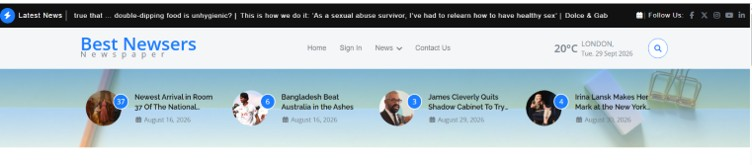

- To the right of the Latest News text and logo is the marquee which shows five of the latest added news articles, which are all clickable and take the visitor to the details page for the article
- To the right of the marquee are a list of social media links
- The current menu items showing are the following: Home, Sign In, News (a dropdown list) and Contact Us. These links are  accessible on all the pages of the website for ease of use. "Home" takes the user back to the home page, "Sign In" allows administrators and correspondents (non-administrators) to log into their news specific account for their category of news they deal with, News lists some sub-menu items (categories) and Contact Us will take the visitor to footer area of the home page where the news agency contact details are. All these menu items can be modified from the admin (Kaiadmin) panel by the administrator (including any sub-menu items if the menu item has a ParentId).
- The temperature (in Celsius), city and date are due to the Open Meteo Weather API (you can customize this to your own location).
- The search icon when clicked will open up a modal where the visitor can search for news using a searchTerm and be taken to a "NewsMedia/Index" search page where a news card or cards related to the searchTerm may or may not be shown (depending on the news articles within the database).
-The row of circular thumbnail images belong to the FeaturedNews (randomly selected and four currently); these can be changes from the Settings table. The number at the top-right of each image is the number of views for that piece of news. Each featured news can be clicked on its title to take the visitor to the details page for that news.

#### Best News and Main News Area

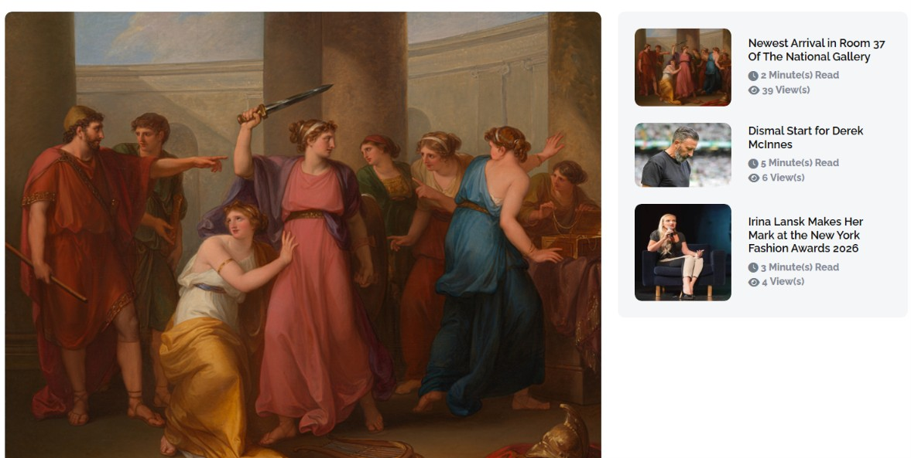

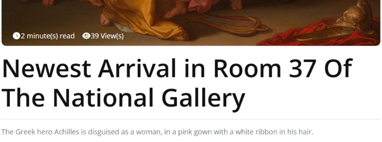

- Below the header area and to the right is a sidebar containing the best news. This list of news can be anything and can be modified in the database. Below each square thumbnail image is the view count and the reading time (calculated with a helper function) and the view count.
- The central large image is part of the main news and the bottom portion also has the reading time and view count; but, also it has a title and short description. The title can be clicked and doing so will take the user to the details page for that news article.

#### Top Story

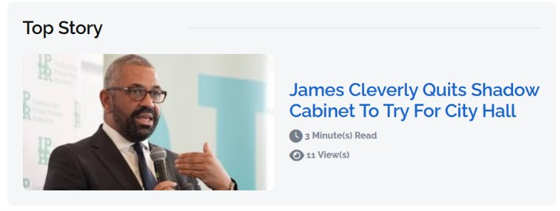

- The top story is up to user discretion and can be changed from the database table; it has a larger image with the reading time, view count and title; the title can be clicked to take the visitor to the details page of the news article.

#### Newsletter Subscription Area

- This section on the home page allows the visitor to subscribe to a newsletter to receive the news they are interested in (simulating this) by submitting their email.

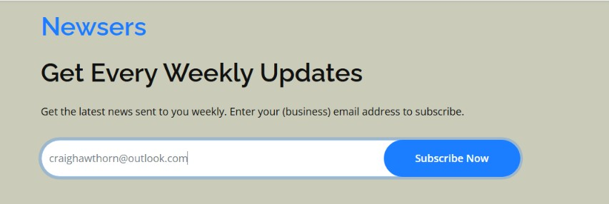

- After entering a valid email address a message will display in the input element, thanking the visitor for subscribing.

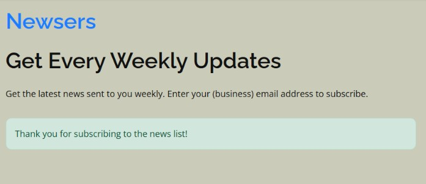

- If the visitor clicks the "Subscribe Now" with an empty input field they will get a alert telling them to enter a valid email address.

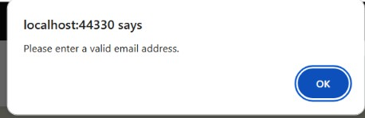

- If the visitor enters an email with an invalid syntax and tries to subscribe, the validation will trigger and ask the user to include the "at" (@) symbol.

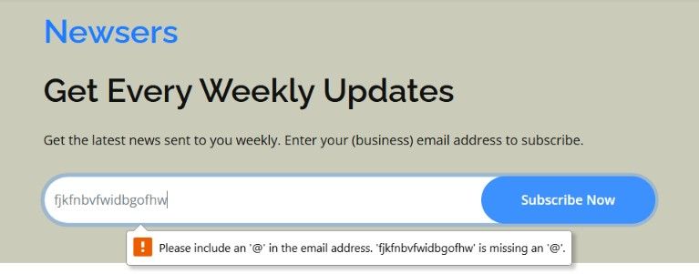

-What if an email address that was submitted previously is entered again? An alert will appear letting the visitor they are already subscribed.

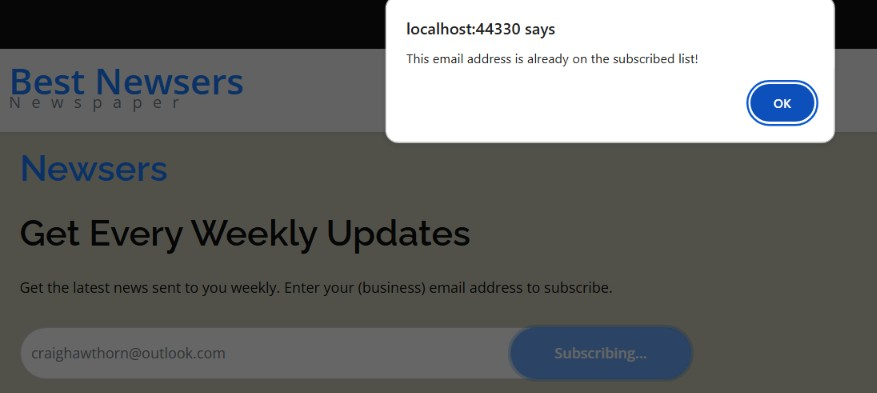

#### Latest News

- This portion of the page makes use of the Owl Carousel jQuery plugin to make a resposive carousel of news articles.
- The latest news makes use of the NewsView View table, which allows the user's (news correspondent's) name to be assigned to a specific article.
- The left and right navigation arrow buttons make use of the navClass array items the path "wwwroot/user/lib/owlcarousel/owlcarousel.lib".
- Each rectagular card is a 
 element containing the thumbnail image, title, user's full name (news correspondent full name) and date.
- The latest news is a list of ten news articles from the most recent to the oldest in terms of creation date.

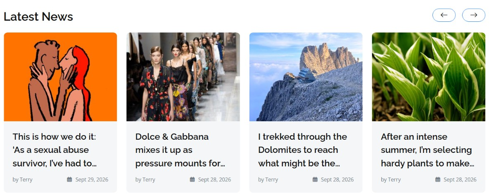

#### What's New Area

- Here the visitor can select news articles by the specific category. 
- Each category can show a maximum of five new articles with the most recent (by creation date) news article having a large image in the centre with the title, reading time, view count and short description underneath.
- The pill-shaped categories the visitor can click on can be customized in the database to show different ones; only four categories are shown to avoid visual clutter.
- The remaining four or less news articles (other than the most recent) are shown as small featured segments to the right with the category name, title and date of creation underneath the thumbnail-sized image.

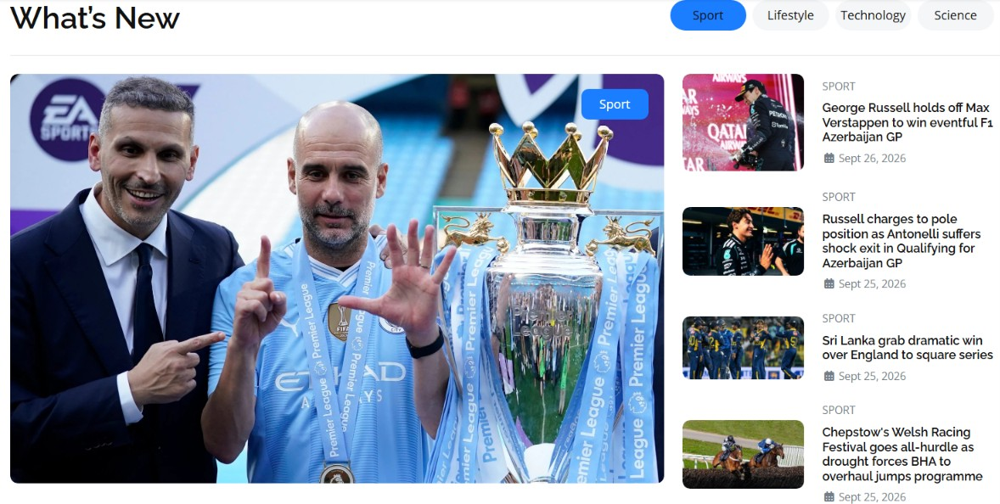

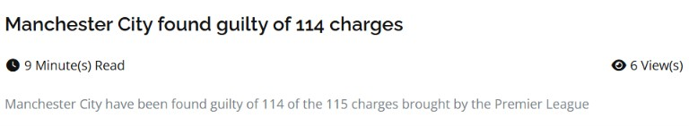

#### Most Views News Area

- This section shows ten news articles, which has been viewed the most by other visitors. This means the news articles are ordered by view count from the highest to the lowest.
- The news articles are shown on a carousel (due to the addition of the owl-carousel class) with left and right navigation arrow buttons like the latest news section.
- Each news article consists of the following: a thumbnail-sized image which zooms in when hovered over, title, user's full name (as the Most Views News is based off of the NewsView derived view table) and the date of creation.

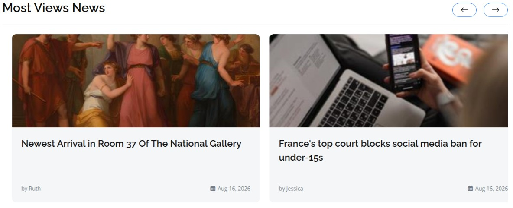
 

#### Footer Area

- There is the contact information (address, email address and phone) underneath the "Get In Touch" along with some social media links
- To the right of the contact information is the "Recent Posts", which shows two of the recently created news articles that are published. Note: news articles can be made unpublished by a news correspondent in the admin area if modification of removal is needed. These posts are ordered from the most the most newly created to the oldest. Each recent posts consists of a thumbnail-sized image, title and date.
- Next, continuing on rightwards is the Categories (the type and amount can be modified in the database); clicking on a category will take the visitor to the "NewsMedia/Index" search page with articles relevant to the category.
- Finally, there is a gallery of thumbnail-sized images ordered by name (lexicographically), which zoom in when hovered over.

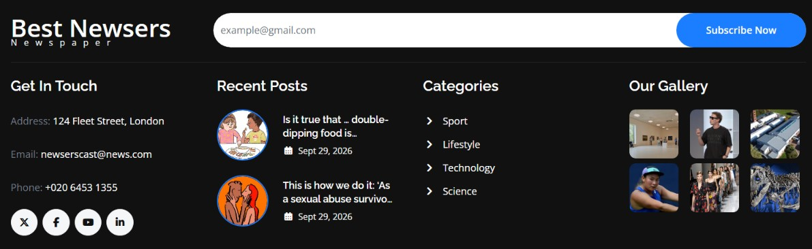

### <ins>News Details Page</ins>

You can get to this page by using the URL address bar of the browser and using the route "/news/{id of the news article}" if you know it.

#### Top Portion of News Details Page

