 # Newsers News Agency

This application is a news agency website with an administration panel, which allows different news correspondents to upload their specialist
articles from their dedicated account. A general administrator has access to all administration panel options and all news articles.

**Programming languages used**: C# ASP.NET Core, JavaScript/AJAX (including plugins and libraries) and JQuery.

**Text Editor Used**: CKEditor.

**Markup used and styling**: HTML5, Bootstrap 5, CSS3, Font Awesome.

**Database(s) used**: SQL Server (via SSMS - SQL Server Management Studio)

## Tables/Views used in SQL Server (with columns)

<ins>Native tables<ins>

1. Category
   1. Id (PK)
   2. Title (nvarchar)
   3. Description (nvarchar)
2. Comment
   1. Id (PK)
   2. FullName (nvarchar)
   3. Email (nvarchar)
   4. CommentText (nvarchar)
   5. CreatedAt (datetime)
   6. IsApproved (bit)
   7. NewsId (FK) (int)
3. Menu
   1. Id (PK)
   2. Title (nvarchar)
   3. Link (nvarchar)
   4. ParentId (not null is sub-menu item) (int)
   5. Priority (controls the order of the menu item(s)) (smallint)
4. Tag
   1. Id (PK)
   2. Title (nvarchar)
5. User
   1. Id (PK)
   2. FullName (nvarchar)
   3. Username (nvarchar)
   4. Password (nvarchar)
   5. IsActive (bit)
   6. IsAdmin (bit)
6. News
   1. Id (PK)
   2. Title (nvarchar)
   3. ShortDescription (nvarchar)
   4. LongDescription (nvarchar)
   5. CreatedAt (datetime)
   6. ViewCount (int)
   7. Status (Published or Unpublished) (nvarchar)
   8. ImageName (nvarchar)
   9. CategoryId (FK) (int)
   10. Tags (nvarchar)
   11. UserId (FK) (int)
7. Settings
   1. Id (PK)
   2. Title (nvarchar)
   3. Address (nvarchar)
   4. Email (nvarchar)
   5. Phone (nvarchar)
   6. Copyright (nvarchar)
   7. Facebook (nvarchar)
   8. X (nvarchar)
   9. Instagram (nvarchar)
   10. YouTube (nvarchar)
   11. LinkedIn (nvarchar)
   12. FeaturedNews (nvarchar)
   13. MainNews (int)
   14. TopStory (int)
   15. BestNews (nvarchar)
   16. MainPageCategories (nvarchar)
8. Subscriber
   1. Id (PK)
   2. Email (nvarchar)
   3. SubscribedAt (datetime)
   4. IsActive (bit)

<ins>Derived Views</ins>

1. NewsView (Forms a LEFT OUTER JOIN using the News and User tables - allows allocation of correspondent specific news)
2. PopularCategories (Forms a LEFT OUTER JOIN between the Category and News tables - counts the news belonging to each category and groups them by Title and Id and uses NewsCount as an alias)
3. PopularNews (This is based on the news articles with the most comments using a RIGHT OUTER JOIN of the News and Comment tables - includes all the columns from the News table but with an extra columns for the quantity of comments user each news article (the alias CommentCount is used for this derived column)

## News Agency Site Navigation

### <ins>Home Page</ins>

#### Navbar Area:

- To the right of the Latest News text and logo is the marquee which shows five of the latest added news articles, which are all clickable and take the visitor to the details page for the article
- To the right of the marquee are a list of social media links
- The current menu items showing are the following: Home, Sign In, News (a dropdown list) and Contact Us. These links are  accessible on all the pages of the website for ease of use. "Home" takes the user back to the home page, "Sign In" allows administrators and correspondents (non-administrators) to log into their news specific account for their category of news they deal with, News lists some sub-menu items (categories) and Contact Us will take the visitor to footer area of the home page where the news agency contact details are. All these menu items can be modified from the admin (Kaiadmin) panel by the administrator (including any sub-menu items if the menu item has a ParentId).
- The temperature (in Celsius), city and date are due to the Open Meteo Weather API (you can customize this to your own location).
- The search icon when clicked will open up a modal where the visitor can search for news using a searchTerm and be taken to a "NewsMedia/Index" search page where a news card or cards related to the searchTerm may or may not be shown (depending on the news articles within the database).
-The row of circular thumbnail images belong to the FeaturedNews (randomly selected and four currently); these can be changes from the Settings table. The number at the top-right of each image is the number of views for that piece of news. Each featured news can be clicked on its title to take the visitor to the details page for that news.

#### Best News and Main News Area

- Below the header area and to the right is a sidebar containing the best news. This list of news can be anything and can be modified in the database. Below each square thumbnail image is the view count and the reading time (calculated with a helper function) and the view count.
- The central large image is part of the main news and the bottom portion also has the reading time and view count; but, also it has a title and short description. The title can be clicked and doing so will take the user to the details page for that news article.

#### Top Story

- The top story is up to user discretion and can be changed from the database table; it has a larger image with the reading time, view count and title; the title can be clicked to take the visitor to the details page of the news article.

#### Newsletter Subscription Area

- This section on the home page allows the visitor to subscribe to a newsletter to receive the news they are interested in (simulating this) by submitting their email.

- After entering a valid email address a message will display in the input element, thanking the visitor for subscribing.

- If the visitor clicks the "Subscribe Now" with an empty input field they will get a alert telling them to enter a valid email address.

- If the visitor enters an email with an invalid syntax and tries to subscribe, the validation will trigger and ask the user to include the "at" (@) symbol.

-What if an email address that was submitted previously is entered again? An alert will appear letting the visitor they are already subscribed.

#### Latest News

- This portion of the page makes use of the Owl Carousel jQuery plugin to make a resposive carousel of news articles.
- The latest news makes use of the NewsView View table, which allows the user's (news correspondent's) name to be assigned to a specific article.
- The left and right navigation arrow buttons make use of the navClass array items the path "wwwroot/user/lib/owlcarousel/owlcarousel.lib".
- Each rectagular card is a 
 element containing the thumbnail image, title, user's full name (news correspondent full name) and date.
- The latest news is a list of ten news articles from the most recent to the oldest in terms of creation date.

#### What's New Area

- Here the visitor can select news articles by the specific category. 
- Each category can show a maximum of five new articles with the most recent (by creation date) news article having a large image in the centre with the title, reading time, view count and short description underneath.
- The pill-shaped categories the visitor can click on can be customized in the database to show different ones; only four categories are shown to avoid visual clutter.
- The remaining four or less news articles (other than the most recent) are shown as small featured segments to the right with the category name, title and date of creation underneath the thumbnail-sized image.

#### Most Views News Area

- This section shows ten news articles, which has been viewed the most by other visitors. This means the news articles are ordered by view count from the highest to the lowest.
- The news articles are shown on a carousel (due to the addition of the owl-carousel class) with left and right navigation arrow buttons like the latest news section.
- Each news article consists of the following: a thumbnail-sized image which zooms in when hovered over, title, user's full name (as the Most Views News is based off of the NewsView derived view table) and the date of creation.

 

#### Footer Area

- There is the contact information (address, email address and phone) underneath the "Get In Touch" along with some social media links
- To the right of the contact information is the "Recent Posts", which shows two of the recently created news articles that are published. **Note**: news articles can be made unpublished by a news correspondent in the admin area if modification of removal is needed. These posts are ordered from the most the most newly created to the oldest. Each recent posts consists of a thumbnail-sized image, title and date.
- Next, continuing on rightwards is the Categories (the type and amount can be modified in the database); clicking on a category will take the visitor to the "NewsMedia/Index" search page with articles relevant to the category.
- Finally, there is a gallery of thumbnail-sized images ordered by name (lexicographically), which zoom in when hovered over.

### <ins>News Details Page (for a news article)</ins>

You can get to this page by using the URL address bar of the browser and using the route "/news/{id of the news article}" if you know it. However, a more convenient way is just to click the name of the news article you are interested in on the home page or on this news details page.

#### Top Portion of News Details Page

- On this part of the page you will see a breadcrumb with the structure of " Home / News / [news article title].
- Below the breadcrumb is the title and a large image (the image is from the database under the ImageName field) along with the category it belongs to superimposed on the image.
- To the right is a search bar within the placeholder text "News Title" where you can easily type some phrase of keyword into it order to find an article quickly; when enter or the search button is clicked the visitor will be taken to the "NewsMedia/Index" search page where the results of the query will be shown.
- Below the search bar are a list of popular categories ordered by the categories that have the most news articles associated with it (i.e the news count) to the least. From the image below you can see sport has the highest amount of article associated with it.

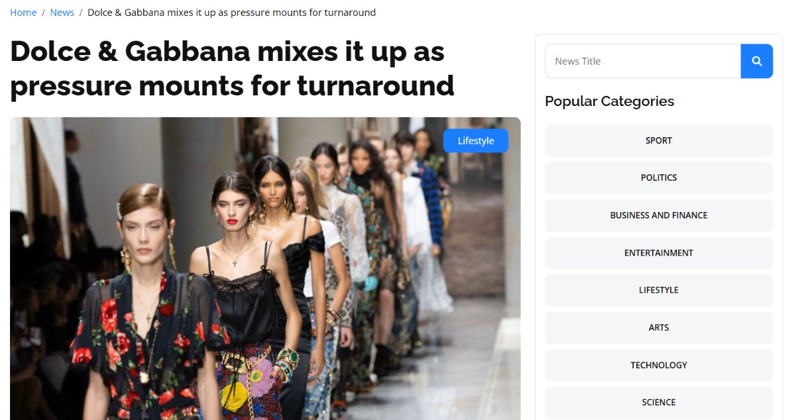

#### Middle Portion of News Details Page

- Here we see the metrics for the specific news article (reading time, view count and the amount of comments for this news article).
- To the right is the popular news, which are up to four news article segments with each news article having the following: a circular thumbnail image (having a superimposed view count on top), news title, and date of creation.
- Also, the start of long description (text) for the news article can be seen.

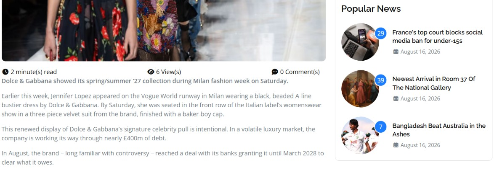

#### Bottom Portion of News Details Page

- Here are the pill-shaped tags, which are in fact links. These are added for search optimization. The associated a news article with a topic. Whenever the visitor clicks a tag they will be taken to "NewsMedia/Index" search page where other news article related to the topic will be shown.
- In the "You Might Also Like" section are up to two news articles. These are related news articles, whcih belong to the same category as the current news article the vistior is reading. Each related news item has a thumbnail-sized image, title and estimated reading time.

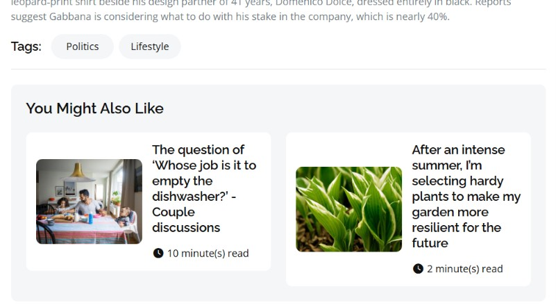
 
- There is a comment form where visitors can comment their thoughts/opinions about the specific news article they have just read.
- After submission of the comment (via entering their full name, email address and comment) the comment will not appear at the bottom of page in the comment section immediately, as comments need to be approved by the administrator first before they appear.

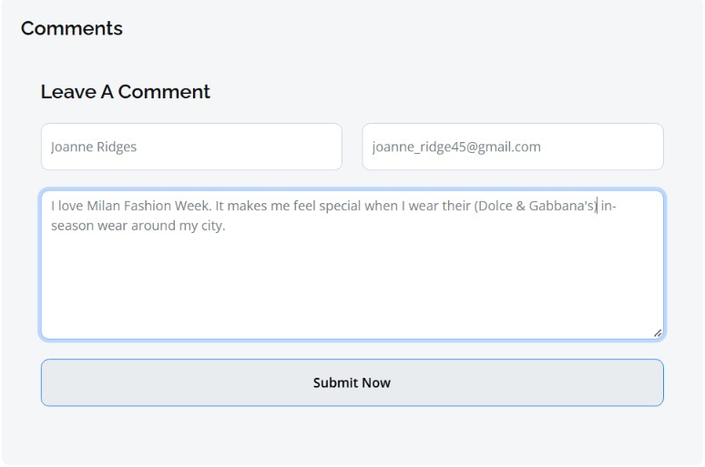

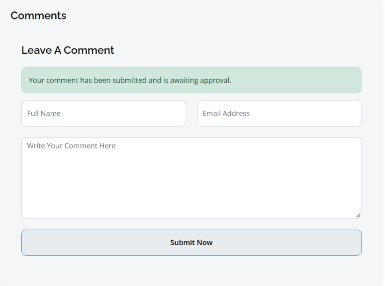

- After approval in the admin (Kaiadmin) panel by the administrator the comments will appear at the bottom of the page for the specific article.

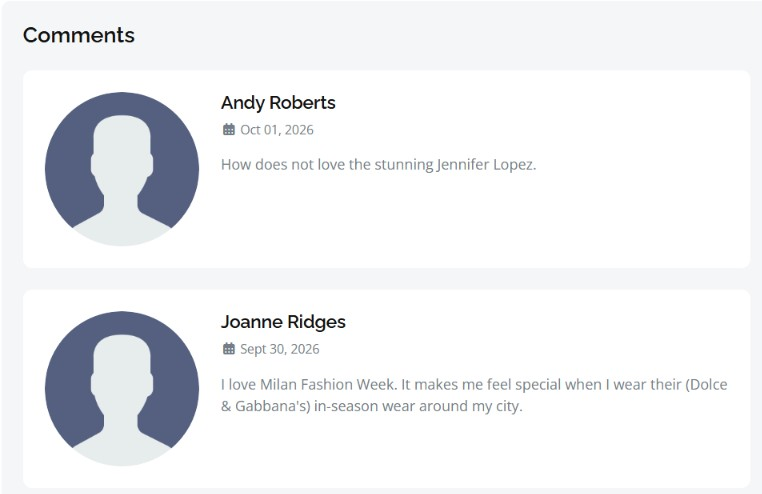

### <ins>Search Page (query for news article(s)) </ins>

- The visitor of the site can reach the "NewsMedia/Index" search page by using the search input bar on the home page (next to the weather information) and using the search bar on top of the "Popular Categories" on the news details page. They can also access it by clicking any category in the footer area or popular categories menu list.

#### Filter News
- In this area the visitor can use the form to search for one or more news articles by Title, Category (a dropdown list) and/or Tag.

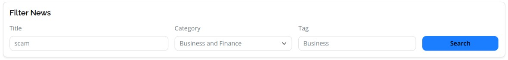

- If there is one or more matches then the will be shown below the form as one or more cards. These cards contain a thumbnail-sized image, title, short description, a "Read More" button and the creation date of the news article.

- If there are no news articles matching the entered criterion/criteria then a message will be displayed showing no matches.

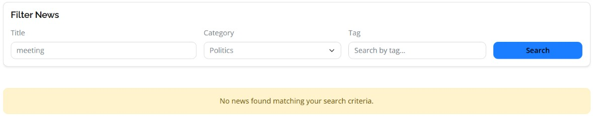

## News Agency Admin Panel

### <ins>Sign In Page</ins>

- Administrators and non-admin users (correspondents) can get to the sign in page by clicking "Sign In" on the navbar area.
- Enter your credentials (username and password)
- **Note**: to allow continued access to the admin panel (e.g. when the browser window is closed and re-opened) you can check the box "Remember Me"; by default the cookies expiration time is 30 days, but you can override this within the Program.cs file, which I have done. In this case at the time of writing it is 10 days for the expiration of a cookie.

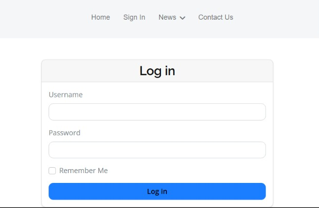

### <ins>Admin Panel For Non-Admin Users (News Correspondents) After Logging In</ins>
- When a user signs in, they will be presented with the news articles they have created only.
- To the top-right is the user's avatar and name; if this is clicked it will expand to show where a "Logout" button, which when clicked will log the user out of their account.

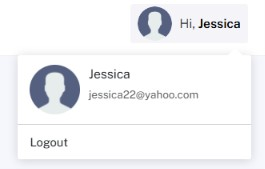

- In the black sidebar at the far left the only option available is the current News menu item; this is because "Jessica" is a non-admin user. None-admin users can only create, edit and delete news articles they have made. They cannot perform CRUD (Create Read Update Delete) on anything else.
- Under the "News Index" text is the "Create News" so the non-admin user can add another news article to the news list.
- The table for the News list is created using the datatables JavaScript library (which created grid tables commonly used in CRM solutions). it has the column headings Title, View Count, Status, Image and Actions. The actions are Font Awesome icons for Edit, Comments and Delete, respectively. **Note**: the Comments icon cannot be used for non-admin users though.
- You can use the search bar to the right of the news list to search for a news article using phrases, letters and words. Furthermore, the correspondent can also use the arrowheads (up and down) to sort the news articles by the column and control the amount of articles shown per page (if there are many articles) with the "Show Entries" dropdown.

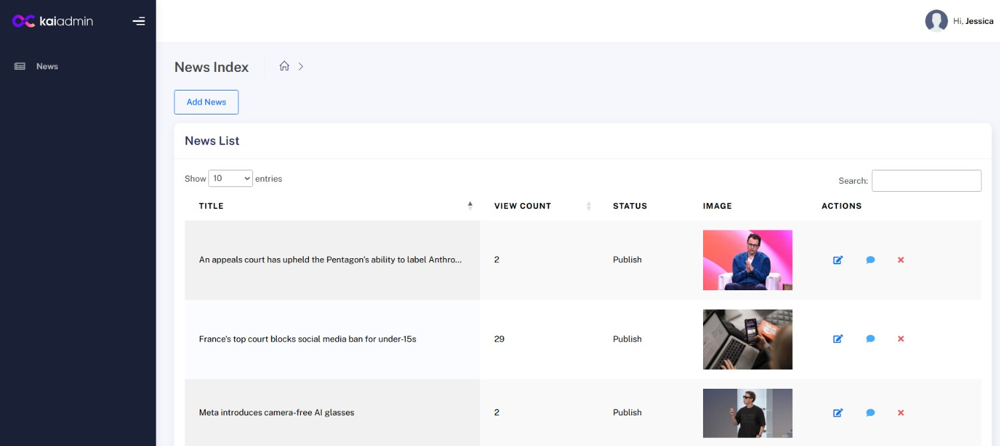

- At the bottom of the News Index page you can see the pages you can select (at the moment only page 1 is showing but if you have multiple articles, then more pages will show) and the range of the entries.

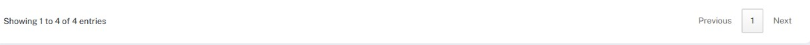

### <ins>Restricted Authorization For Non-Admin Users</ins>

- As hinted above, the news correspondents (non-admin users) only have access to the News Index page and the news articles they have created within their account.
- If they triy to access resources (menu items) only allowed for administrators (Menus, Dashboard, Categories, Tags, Comments, Users, Site Settings and Subscribers via the browser URL address bar (e.g. path "/admin/subscribers" or "/admin/settings/edit") they will be presented with an access denied page. From there the non-admin users can either go back, go to the home page or to the News section of the admin panel.

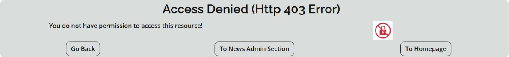

### <ins>Admin Panel Dashboard (For Administrators)</ins>

- The dashboard has some features similar to the non-admin News Index portion of the admin panel (as previously mentioned above).
- The first difference is that there are more menu items available to an administrator than just the News (Dashboard (currently on this), Menus, Categories, Tags, Comments, Users, Site Settings and Subscribers)
- Also, at the top there are a row of metrics detailing the total number of news articles, comments, categories and tags.
- Below the metrics is a dynamic chart made with Chart.js JavaScript library. It shows as lines graphs per month the amount of comments and news articles created for the year; it covers all comments and all news articles (regardless of whether they are published or unpublished).

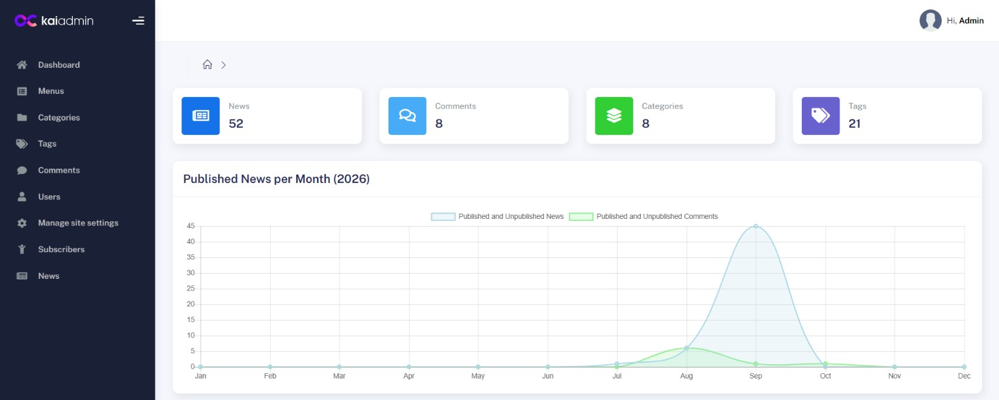

- Also, the user profile (at the top right) is slightly different when clicked; as well as showing the Logout button it also has a "View Profile" button; when this button is clicked it will take the administrator to the user edit page, where he/she can change his/her login details or active status if required.

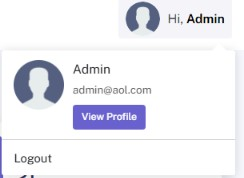

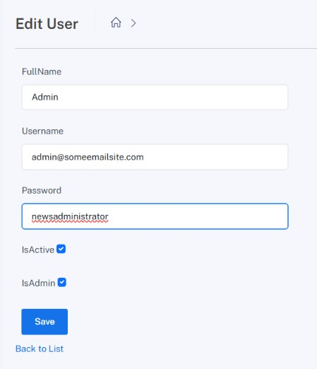

### <ins>Admin Panel Settings (For Administrators)</ins>

- In the "Manage Site Settings" there are two tabs available: "**Global Settings**" and "**News Options**".
- Global Settings tab shows all the text and links for the address/contact information and social media links, respectively. These can be changed.

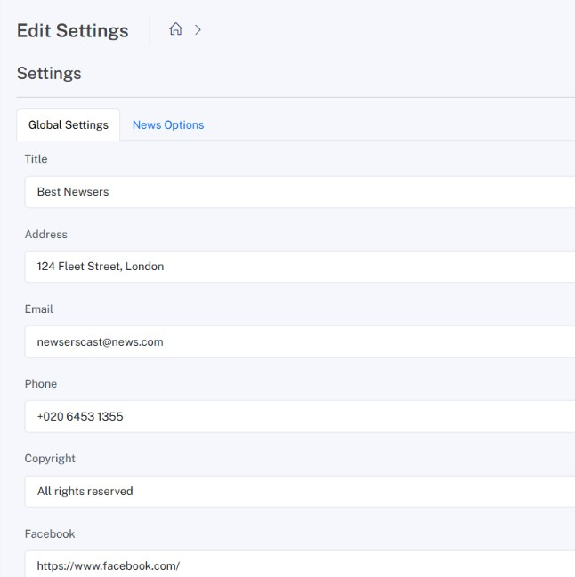

- These Global Settings fields control what is seen in the footer area of the news agency site. This can be handy for example when the organization moves address and/or contact information changes.

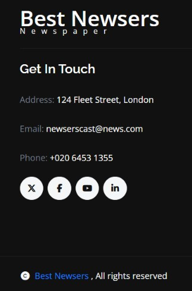

- For the News Options tab shows the Main News Options (the first news article on the home page with the large image), Top Story (the news article immediately below the main news on the home page), Featured News (the four news articles with a circular image on the banner of the navbar for the home page), Best News (the columns of three news articles to the right of the Main News on the home page) and Main Page Categories (this is the list of categories seen within the footer area of the site).

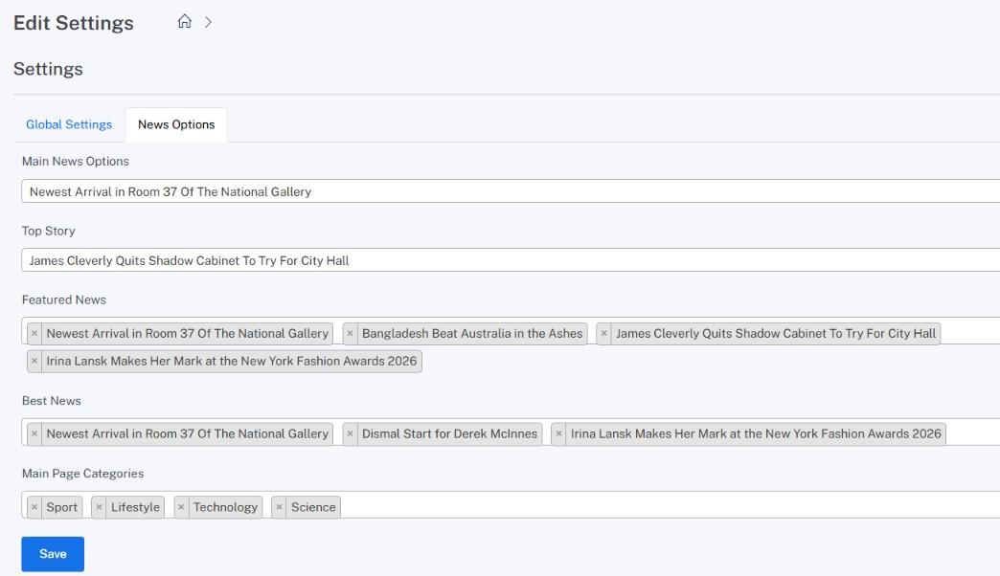

- All the fields in this News Options tab make use of the Select2 jQuery plugin which is a JavaScript replacement for select boxes, which can be single item select or multi-item select.
- The Main News Options and  Top Story are single select so you can type into the Select2 box and it will search for the single article you are looking for, since both these fields only take one news record.

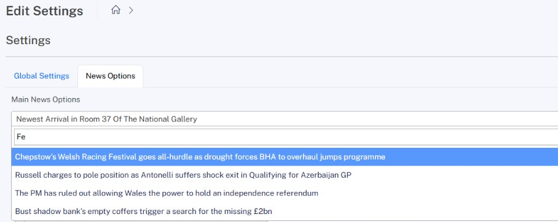

- The Featured News, Best News and Main Page Categories are a list of news articles and categories, respectively (not one item). So these use the multi-select feature of Select2. We can add multiple items to these fields.

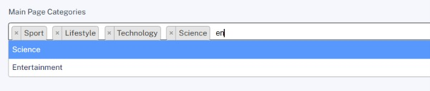

### <ins>Users(For Administrators Within The Admin Panel)</ins>

- When an administrator clicks on the Users menu item they will be presented with rows of news correspondents with a datatable on the User Index. The grid-based table has the following columns: FullName, Username, Password, IsActive and IsAdmin. **Note**: at the time of writing there is only one administrator but technically there can be more.
- At then end of each row are the edit (blue-coloured) and delete (red-coloured) icons, respectively.
- Above the datatable is the "Add New User" button.

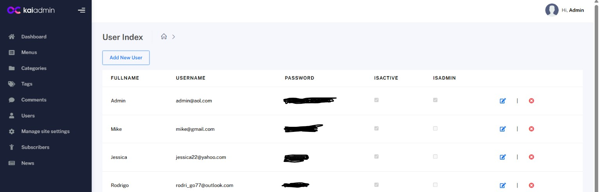

- If the administrator clicks the "Add New User" button, they can add more non-admin or admin users by filling in the form and clicking the "Create" button.

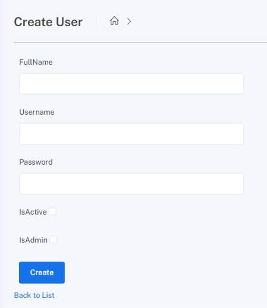

- Also, and administrator is able to disable other users' accounts too. Let's assume the administrator wants to disable Rodrigo's account (he is the correspondent for Science news). To do so click the edit icon on Rodrigo's row in the User Index.

- Now uncheck the checkbox for IsActive and press the "Save" button.

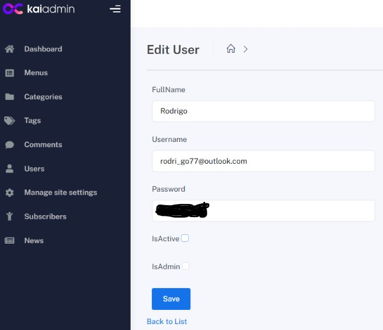

- Now that Rodrigo is an inactive user, if Rodrigo tries to sign into the admin panel, he will not be able to as his account has been disabled. For his account to be active again the administrator needs to go back to the edit pack and check the IsActive box. This procedure is more flexible than just deleting an account, which can still be done by an administrator.

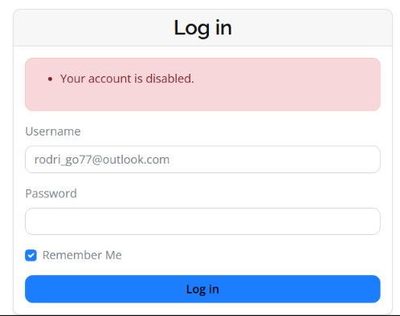

To delete a user click the red cross icon on a user's row in the User Index and click the "Delete" button.

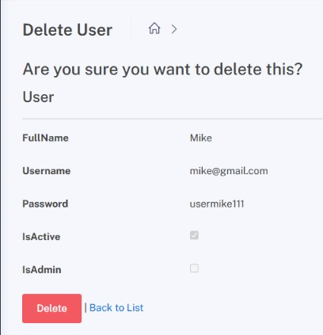

### <ins>Categories,Tags and Subscribers(For Administrators Within The Admin Panel)</ins>

- The administrator also has access to the Categories, Tags and Subscribers from the sidebar of the admin panel. They have a similar appearance to the other sections mentioned previously with edit and delete icons and "Add" (similar to the "Create User" button). They also have the information on their Index page arranged in datatables.

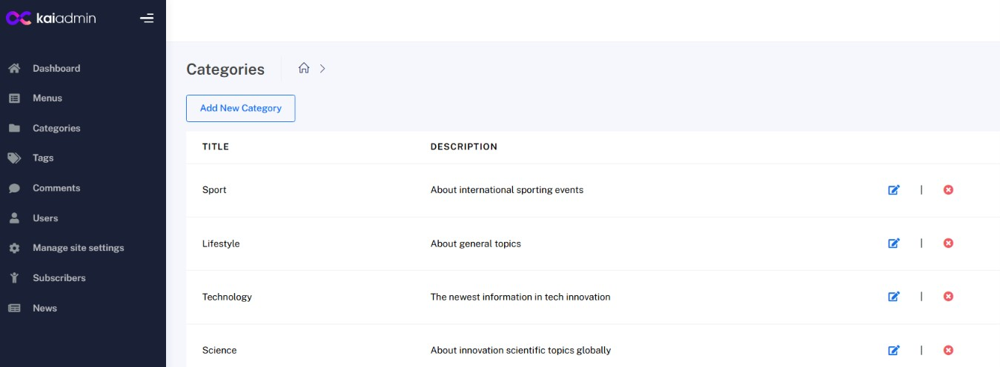

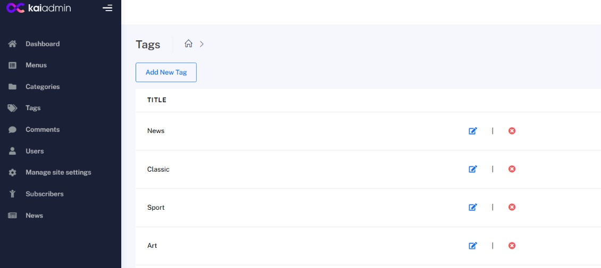

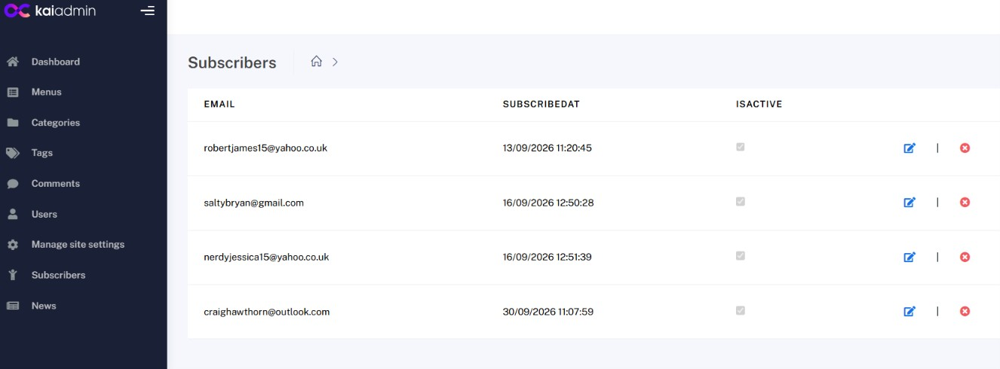

### <ins>Menu Area(For Administrators Within The Admin Panel)</ins>

- The Menus index page controls and corresponds with the links that are visible within the navbar/header area of the news agency site.
- The columns for the datatable are Title, Link, ParentId and Priority.

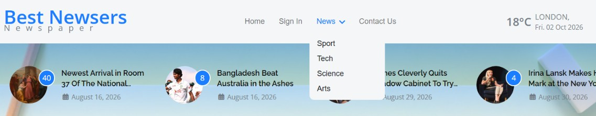)

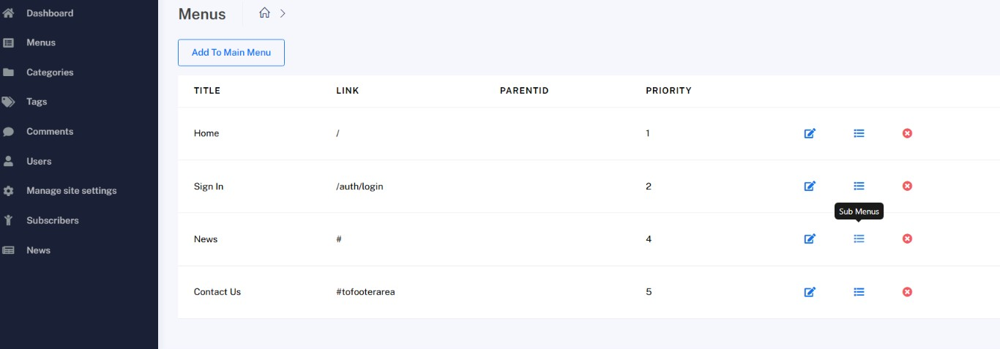)

- Also, note in the image above that I am hovered the cursor over the sub-menu Font Awesome icon. If a menu item has a sub-menu item within it then those sub-menu items will have a ParentId that is not null. The Priority controls the ordering the menu (sub-menu) items from left to right.

- If you click on the "Sub Menus" icon for a main menu item, the administrator will be able to see (if any) the sub-menu items for a main menu item. Notice that they have associated ParentIds liking them to the main menu item.

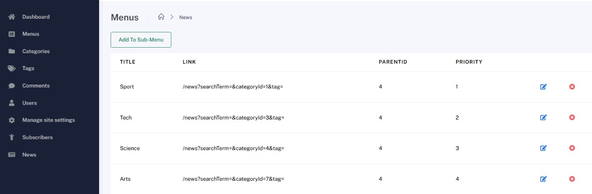)

### <ins>Comments Area(For Administrators Within The Admin Panel)</ins>

- A comment added on the details page of a news article will not appear in the comments under an article immediated; it must be approved by an administrator.

- Assume a person types a comment under a news article:

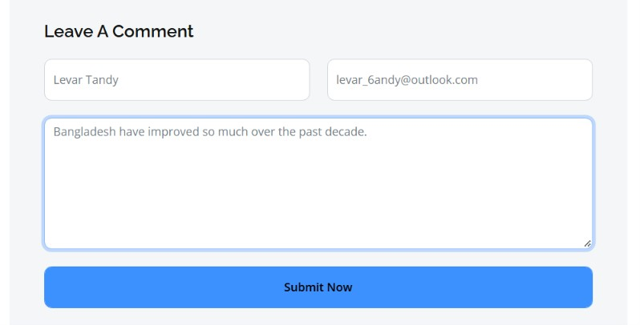)

- Now a notification appears about the comment being submitted and awaiting approval:

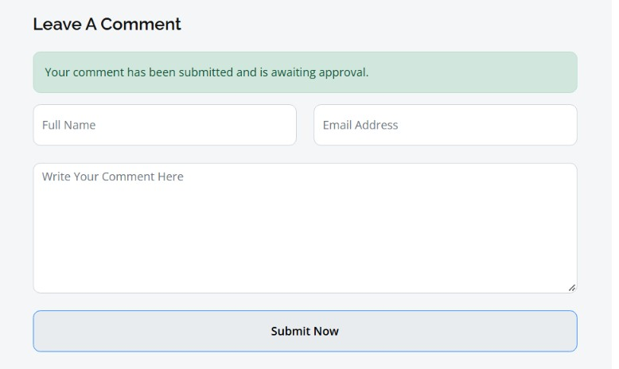)

- If the administrator clicks the Comments from the sidebar they will now see the comment and its details in the datatable with the following columns: FullName, Email, CreatedAt and IsApproved. Note that the IsApproved checkbox for the newly submitted comment is not currently checked:

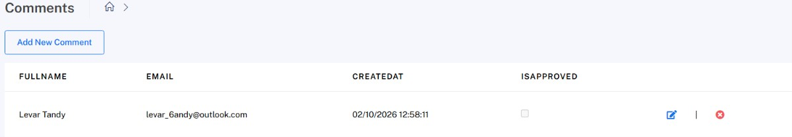)

- Now click on the Font Awesome edit icon for the comment and then check the isApproved checkbox and press the "Save" button:

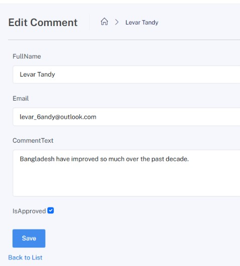)

- If you visit the same article where the comment was made it will now appear in the comments list:

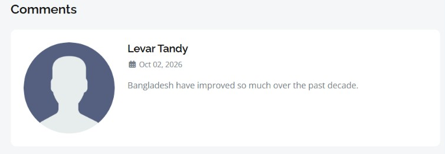)

### <ins>News Index Area(For Administrators Within The Admin Panel)</ins>

- The News Index page for administrators is similar to that of non-admin users, except that the administrator has access to all news articles from all user accounts (administrator created news articles and those created by news correspondents). **Note**: I have the cursor hovered over the Comments Font Awesome icon as administrators are allowed to add comments under news articles directly without having to go to the specific news article on the site.

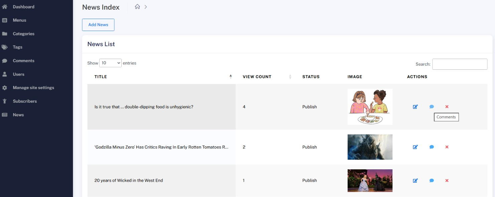

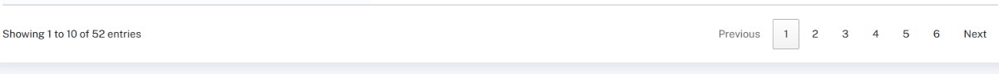

- Click the "Add New Comment" button in order to create a new comment once you have selected the Comments icon as an administrator:

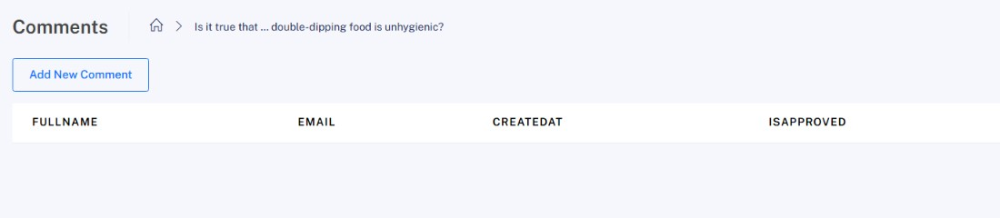

- Now create the comment by filling in the fields and choosing where it should be an approved comment:

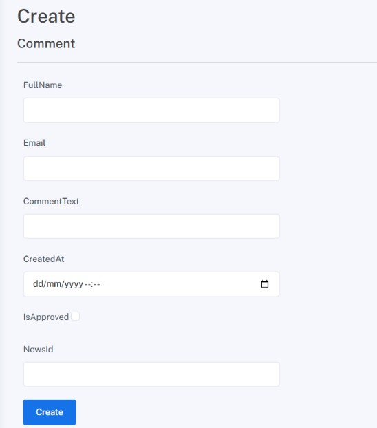

- If you click the "Add News" button on the News Index page, a new news article can be created (this is the same for administrators and non-admin accounts). Notice that for the "LongDescription" field that it makes use of the CKEditor; CKEditor is a text editing framework similar to what you find on word processing applications. It can be used with <textarea> to add font styling, media, images, bulleted lists,numbered lists, grid tables and much more.

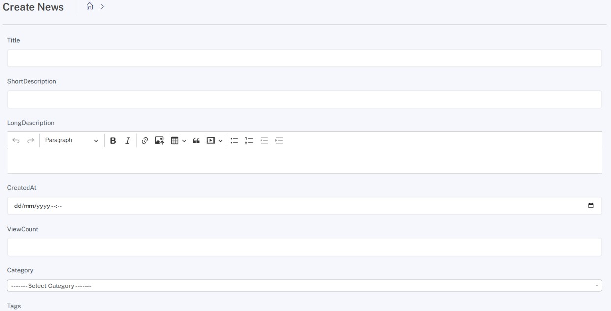

